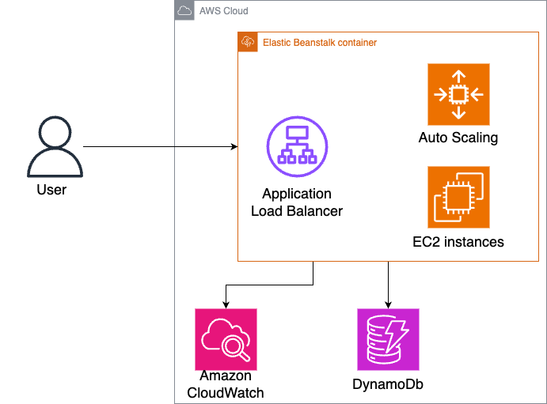
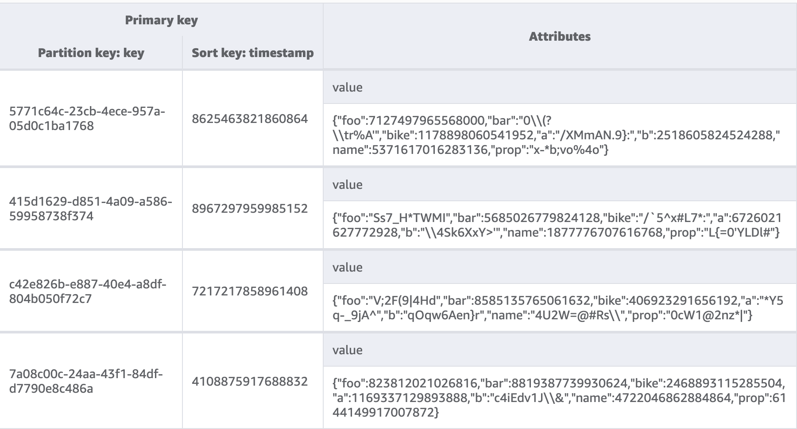

****
# Version-controlled Key Value Store API
This is an API that can be used to query a version-controlled key value store. You can try out the API by clicking the "Run in Postman" button below.

[](https://app.getpostman.com/run-collection/9636334-7890a2b0-48a0-4515-b21e-11c8c4ffb615?action=collection%2Ffork&source=rip_markdown&collection-url=entityId%3D9636334-7890a2b0-48a0-4515-b21e-11c8c4ffb615%26entityType%3Dcollection%26workspaceId%3D06c6778a-a3f4-4204-a7f0-dd9b9d3c5694)


### API endpoints
Base path: http://key-value-store.ap-southeast-1.elasticbeanstalk.com/api/v1
<table>
<thead>
<tr>
<th></th>
<th>Http Method</th>
<th>Function</th>
<th>Example Parameters</th>
<th>Example Response</th>
</tr>
</thead>
<tbody><tr>
<td><a href="http://key-value-store.ap-southeast-1.elasticbeanstalk.com/api/v1/get_all_records"> /get_all_records </a></td>
<td>GET</td>
<td>Returns JSON Array of all records data and their values currently stored in the DB</td>
<td>
N/A
</td>
<td>

```json
{
    "data": [
        {
            "key": "key7",
            "value": "example text content of key 7.",
            "timestamp": 1656397200
        },
        {
            "key": "key7",
            "value": "\t example text content of key 7",
            "timestamp": 1656397211
        },
        {
            "key": "key10",
            "value": "example text content of key 10.",
            "timestamp": 1656483600
        }
    ]
}
```
</td>
</tr>
<tr>
<td><a href="http://key-value-store.ap-southeast-1.elasticbeanstalk.com/api/v1/object/key1"> /object/{key} </a></td>
<td>GET</td>
<td>Return the key's value at a specific time</td>
<td>
<code>/object/key7<code>
<td>
    
```json
{
    "data": {
        "key": "key7",
        "value": "\t example text content of key 7",
        "timestamp": 1656397211
    }
}
```

</td>
</tr>
<tr>
</td>
</tr>
<tr>
<td><a href="http://key-value-store.ap-southeast-1.elasticbeanstalk.com/api/v1/object/key1"> /object/{key} </a></td>
<td>GET</td>
<td>Return the key's latest value</td>
<td>
<code>/object/key7?timestamp=1656397200<code>
<td>

    
```json
{
    "data": {
        "key": "key7",
        "value": "\t new example text content of key 7",
        "timestamp": 1656397200
    }
}
```
</td>
</tr>
<tr>
<td><a href="http://key-value-store.ap-southeast-1.elasticbeanstalk.com/api/v1/object"> /object </a></td>
<td>POST</td>
<td>Store key value pair</td>
<td>
request body: <code>{"mykey" : "value1"}<code>
<td>

    
```json
{
    "data": {
        "key": "mykey",
        "value": "value1",
        "timestamp": 1719344835
    }
}
```
</td>
</tr>
</tbody></table>

## Architecture
the cloud infrastructure resource, DynamoDb are defined and provisioned using AWS Cloudformation. Deployment to Elastic Beanstalk environment has been made using `awsebcli`. This is the architecture used.



## Data model
The DynamoDB data model looks like this.
|                         | Partition Key | Sort Key        |
|-------------------------|---------------|-----------------|
| KeyValueStore         | key          | timestamp        |
    
 Example



Please note that data model design of the dynamodb table varies depending on the data size and predicted read&write frequency. For example, if the predicted read&frequency rate is not that high, we could create a Global Secondary Index(GSI) that has a constant static key like `"ALL_ITEMS"` as the partition key. By doing so, the query to get all records will become more efficient since dynamodb query perfomance will be very fast if we specify partition key during query. On the other hand, if the read&frequency rate is predicted to be very high, we shall consider partition key sharding. 

## Coverage report
https://github.com/SarahTeoh/key-value-store/pull/6#issuecomment-2190340867 
    
## Environment setup to run locally

### Requirements
You need these on your computer before you can proceed with the setup.
* PHP >= 8.2 
* aws cli 
* dynamodb local

### To Run locally
1. Clone this repository
```
$ git clone https://github.com/SarahTeoh/key-value-store.git 
$ cd key-value-store 
```

2. Set up configuration
```
$ cp .env.example .env
```
Open .env file and configure the DYNAMODB_* and AWS_*.

* DYNAMODB_CONNECTION: 'local' or 'test' for local
* DYNAMODB_LOCAL_ENDPOINT: Your DynamoDB local endpoint with port
* DYNAMODB_TABLE_NAME: DynamoDB table name you've created.
* AWS_ACCESS_KEY_ID
* AWS_SECRET_ACCESS_KEY
* AWS_DEFAULT_REGION

3. Install PHP dependencies

```
$ composer install
```

4. Generate application key
```
$ php artisan key:generate
```

5. Create dynamodb table in dynamodb local
```
aws dynamodb create-table --cli-input-json file://database/create-dynamodb-table.json --endpoint-url http://localhost:8000 
```
Change the endpoint url to your dynamodb local endpoint url.
    
6. Check table created
```
aws dynamodb list-tables --endpoint-url http://localhost:8000
```

7. Seed local dynamodb table
```
php artisan db:seed --class=KeyValueSeeder
```
    
8. Run the dev server (the output will give the address):
```
$ php artisan serve
```
    
That's it! You can use curl or Postman to try the API.
